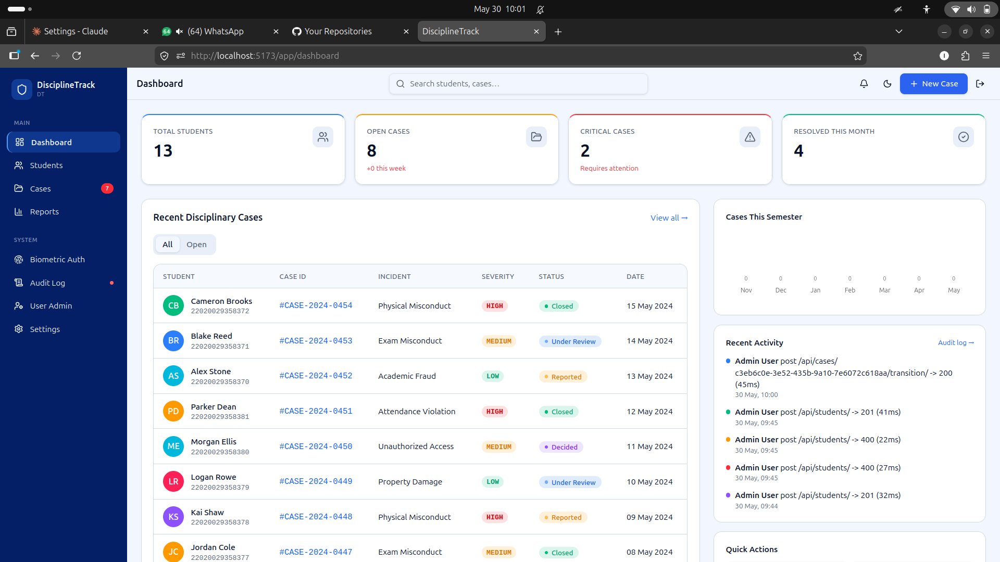
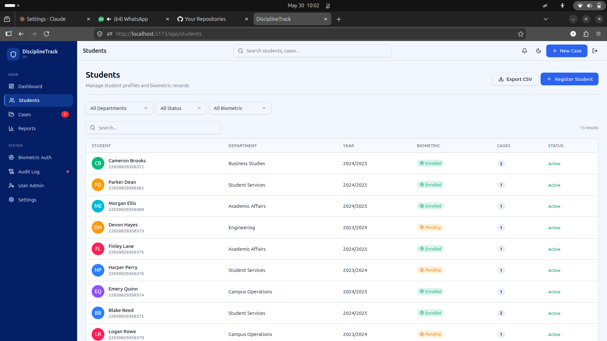
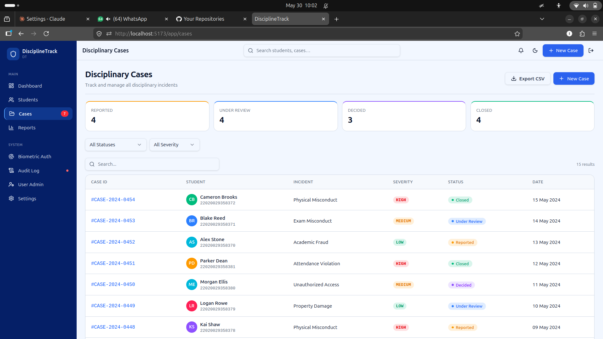
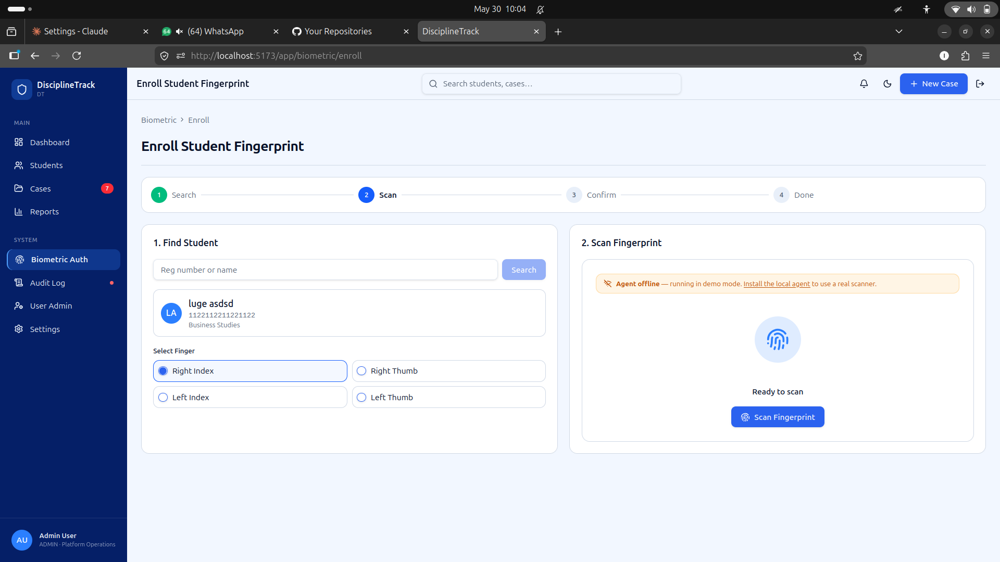
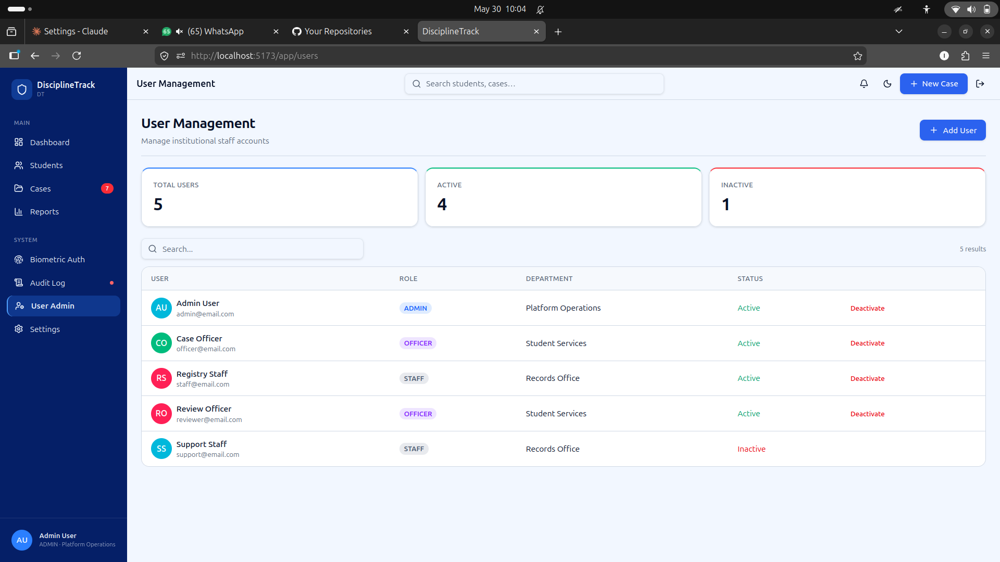
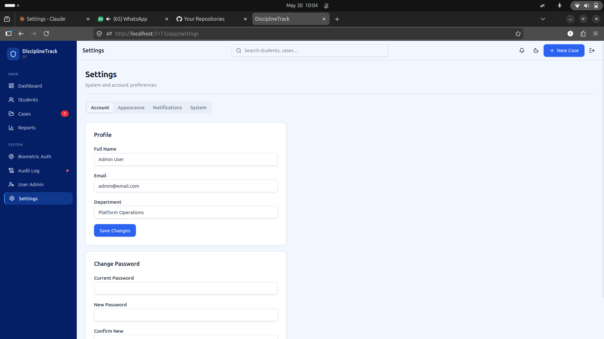

# DisciplineTrack — Student Disciplinary Management System

> A secure, biometric-backed, role-based web application for managing student disciplinary records, cases, and identity verification in higher-learning institutions.
>
> Based on the research paper: *A Secure Biometric System for Monitoring Student Disciplinary and Crime History in Higher Learning Institutions* — SAWIYA SAYID SALIM, DIT OD23IT

---

## Screenshots

### Dashboard

Real-time headline metrics (total students, open cases, critical cases, resolved this month), a filterable recent-cases table, a month-by-month bar chart, a live activity feed from the audit log, and quick-action shortcuts.

### Students

Paginated student roster with department, academic year, biometric enrollment status, case count badge, and active/inactive status. Filterable by department, status, and biometric state. Leads into full student profiles with linked case history.

### Disciplinary Cases

Full case pipeline with status summary cards (Reported / Under Review / Decided / Closed), sortable data table, severity and status badges, and per-row navigation to the full case detail page with notes, evidence documents, and status transition controls.

### Biometric Enrollment

4-step guided enrollment wizard: find student by reg number → scan fingerprint (live via local agent or demo simulation) → review captured template hash and quality score → confirm and POST to the API. Shows agent connection status and finger selection.

### User Management

Admin-only view showing all institutional staff accounts with their role badge (ADMIN / OFFICER / STAFF), department, and active status. Includes deactivate action per row and a user creation form.

### Settings

Tabbed settings panel: account profile, password change, appearance (light/dark theme), notification preferences, and a system tab (admin only) for institution name, academic year, and operational parameters.

---

## What This System Does

DisciplineTrack gives higher-learning institutions a single, audited interface to:

| Capability | Detail |
|---|---|
| **Student registry** | Register, search, edit, and soft-deactivate student profiles with photos |
| **Biometric enrollment** | Capture and store fingerprint template hashes for enrolled students |
| **Biometric verification** | Identify a student from a live fingerprint scan without keying in a reg number |
| **Disciplinary cases** | File cases via a guided multi-step wizard (student → incident → evidence → review) |
| **Case workflow** | Progress cases through REPORTED → UNDER REVIEW → DECIDED → CLOSED with outcome recording |
| **Evidence management** | Upload and download case documents; add internal officer notes |
| **Reports & analytics** | Charts for monthly trends, incident type breakdown, department distribution, and repeat offenders |
| **Audit trail** | Immutable append-only log of every meaningful system action with user, timestamp, and IP |
| **Role-based access** | ADMIN / OFFICER / STAFF roles enforced both in the API and in the UI |
| **User management** | ADMIN-only creation and deactivation of staff accounts |

---

## Tech Stack

### Frontend
| Technology | Version | Purpose |
|---|---|---|
| React | 19 | UI rendering |
| TypeScript | 5.8 | Type safety across the whole codebase |
| TanStack Start | 1.x | Full-stack framework (SSR shell, file-based routing) |
| TanStack Router | 1.x | File-based type-safe routing with route params |
| TanStack Query | 5.x | Server state, caching, background refetch, mutations |
| Zustand | 5 | Client-only state (auth session, theme) with `persist` middleware |
| Tailwind CSS | 4 | Utility-first styling |
| Radix UI | latest | Accessible headless component primitives |
| Recharts | 2.x | Dashboard and reports charts |
| Sonner | 2 | Toast notifications |
| date-fns | 4 | Date formatting throughout the UI |
| zod | 3 | Schema validation (forms) |
| react-hook-form | 7 | Form state management |

### Backend (separate repo)
| Technology | Version | Purpose |
|---|---|---|
| Django | 5.0 | Web framework |
| Django REST Framework | 3.15 | REST API |
| SimpleJWT | 5.3 | JWT access + refresh tokens |
| django-cors-headers | 4 | CORS (allows localhost:5173 in development) |
| django-filter | 24 | Query param filtering on list endpoints |
| drf-spectacular | 0.27 | OpenAPI schema generation |
| Pillow | 10 | Student photo uploads |
| SQLite / PostgreSQL | — | Development / production database |

### Local Fingerprint Agent (this repo, `agent/`)
| Technology | Purpose |
|---|---|
| Node.js 18+ | Runtime |
| `ws` | WebSocket server on `localhost:4444` |
| `better-sqlite3` | Local template binary cache |
| `node-ffi-napi` (optional) | Native binding to scanner vendor SDK |

---

## Architecture

```
┌─────────────────────────────────────────────────────────────┐
│  Browser  (React + TanStack Start — localhost:5173)          │
│                                                              │
│  ┌──────────────┐   useQuery / useMutation                   │
│  │  React routes│ ─────────────────────────────────────────► │
│  └──────────────┘   src/api/*.ts  (fetch + JWT)              │
│                                          │                   │
│  ┌──────────────────────────────────┐    │  HTTP             │
│  │  Zustand authStore               │    ▼                   │
│  │  (access token, refresh token,   │  Django REST API       │
│  │   user profile — localStorage)   │  localhost:8000/api/   │
│  └──────────────────────────────────┘    │                   │
│                                          │  SQLite / Postgres │
│  ┌──────────────────────────────────┐    │                   │
│  │  useFingerprint hook             │    └───────────────────┘
│  │  (WebSocket ws://localhost:4444) │
│  └──────────┬───────────────────────┘
└─────────────┼───────────────────────────────────────────────┘
              │  WebSocket
              ▼
┌─────────────────────────────────────────────────────────────┐
│  Local Fingerprint Agent  (agent/index.js — Node.js)         │
│                                                              │
│  ┌──────────────────┐    ┌──────────────────────────────┐   │
│  │ templates.db     │    │ Scanner SDK (SecuGen/Mantra)  │   │
│  │ (SQLite)         │    │ via node-ffi-napi             │   │
│  │ template binaries│    └──────────────┬───────────────┘   │
│  │ (never leave     │                   │ USB                │
│  │  this machine)   │    ┌──────────────▼───────────────┐   │
│  └──────────────────┘    │  Physical fingerprint scanner │   │
│                          └──────────────────────────────┘   │
└─────────────────────────────────────────────────────────────┘
```

### Why a local agent?

Browsers cannot directly access USB devices for fingerprint scanners. More importantly, **real scanners produce slightly different template bytes each scan** (pressure, orientation, moisture differ). SHA256 of scan 1 ≠ SHA256 of scan 2 for the same finger. The vendor SDK has a native `match()` function that tolerates this variance and returns a similarity score.

The local agent:
1. Captures the live fingerprint via USB scanner
2. Runs **1:N matching** against all locally cached templates using the vendor SDK
3. Returns the **stored hash** of the matched student (the hash originally stored in Django at enrollment time)
4. The browser posts this known hash to `POST /api/biometric/verify/`, which does a simple exact-hash lookup and returns the student record

Raw biometric data (template binaries) **never leaves the workstation**.

---

## Project Structure

```
UI/
├── agent/                        Local fingerprint bridge agent
│   ├── index.js                  WebSocket server + scanner abstraction
│   ├── package.json
│   ├── README.md                 Full agent documentation
│   └── templates.db              Created at runtime — local template cache
│
├── public/
│   └── screenshots/              UI screenshots for this README
│
├── src/
│   ├── api/                      API service layer
│   │   ├── client.ts             fetch wrapper: JWT, auto-refresh, envelope normalisation
│   │   ├── auth.ts               (auth handled inline in authStore)
│   │   ├── students.ts           list, get, create, update, deactivate, cases
│   │   ├── cases.ts              list, get, create, update, transition, notes, documents
│   │   ├── departments.ts        list, get, create
│   │   ├── incidentTypes.ts      list (read-only)
│   │   ├── users.ts              list, get, create, update, deactivate
│   │   ├── biometric.ts          enroll, verify
│   │   ├── reports.ts            dashboard stats
│   │   └── audit.ts              list
│   │
│   ├── components/
│   │   ├── layout/
│   │   │   ├── Sidebar.tsx       Navigation sidebar with role-aware items
│   │   │   └── Topbar.tsx        Top bar with search, theme toggle, notifications
│   │   ├── shared/
│   │   │   ├── Avatar.tsx        Initials avatar with colour from name hash
│   │   │   ├── BiometricSimulator.tsx  Real scanner UI + demo fallback
│   │   │   ├── DataTable.tsx     Generic sortable/searchable/paginated table
│   │   │   ├── EmptyState.tsx    Empty state placeholder
│   │   │   ├── PageHeader.tsx    Page title + subtitle + action slot
│   │   │   ├── RoleBadge.tsx     Coloured role chip (ADMIN / OFFICER / STAFF)
│   │   │   ├── SeverityBadge.tsx Severity chip (LOW / MEDIUM / HIGH)
│   │   │   ├── StatCard.tsx      Metric card used on dashboard and reports
│   │   │   └── StatusBadge.tsx   Case status chip with pulse animation
│   │   └── ui/                   Radix UI + shadcn primitives (40+ components)
│   │
│   ├── hooks/
│   │   ├── use-mobile.tsx        Breakpoint hook
│   │   ├── usePermission.ts      Role-gate helper: usePermission(['ADMIN','OFFICER'])
│   │   └── useFingerprint.ts     WebSocket hook for the local agent
│   │
│   ├── routes/
│   │   ├── __root.tsx            HTML shell, QueryClientProvider, error boundary
│   │   ├── index.tsx             Redirects / → /app/dashboard
│   │   ├── login.tsx             Public login page (email/password + biometric)
│   │   ├── _app.tsx              Protected shell: sidebar + topbar + auth gate
│   │   ├── _app.app.dashboard.tsx
│   │   ├── _app.app.students.index.tsx
│   │   ├── _app.app.students.$id.tsx
│   │   ├── _app.app.students.new.tsx
│   │   ├── _app.app.students.$id.edit.tsx
│   │   ├── _app.app.cases.index.tsx
│   │   ├── _app.app.cases.$id.tsx
│   │   ├── _app.app.cases.new.tsx
│   │   ├── _app.app.cases.$id.edit.tsx
│   │   ├── _app.app.biometric.index.tsx
│   │   ├── _app.app.biometric.enroll.tsx
│   │   ├── _app.app.reports.tsx
│   │   ├── _app.app.audit.tsx
│   │   ├── _app.app.users.index.tsx
│   │   ├── _app.app.users.new.tsx
│   │   └── _app.app.settings.tsx
│   │
│   ├── store/
│   │   ├── authStore.ts          JWT tokens + user profile (persisted to localStorage)
│   │   └── themeStore.ts         Light/dark theme (persisted to localStorage)
│   │
│   ├── types/
│   │   └── index.ts              All shared TypeScript types aligned to the API
│   │
│   ├── lib/
│   │   └── utils.ts              Tailwind className merger (cn helper)
│   │
│   ├── router.tsx                TanStack Router + QueryClient wiring
│   ├── start.ts                  TanStack Start entry point
│   └── server.ts                 SSR server entry (error normalisation)
│
├── docs/
│   └── ARCHITECTURE.md           Detailed architecture notes
│
├── .env.local                    Local env vars (gitignored)
├── vite.config.ts
├── tsconfig.json
└── package.json
```

---

## Installation

### Prerequisites

- **Node.js 20+**
- **Python 3.11+** (for the Django API)
- The backend API repository cloned and running

### 1. Clone and install

```bash
git clone git@github.com:troubleman96/fingerprint-project-UI.git
cd fingerprint-project-UI
npm install
```

### 2. Configure environment

Create `.env.local` in the project root:

```env
# URL of the running Django API (no trailing slash)
VITE_API_URL=http://localhost:8000

# WebSocket URL of the local fingerprint agent (default port 4444)
VITE_FINGERPRINT_AGENT_URL=ws://localhost:4444
```

`.env.local` is gitignored. Never commit secrets here.

### 3. Start the Django API

```bash
cd ../API
pip install -r requirements/development.txt
python manage.py migrate
python manage.py seed          # loads demo departments, users, students, cases
python manage.py runserver
```

The seed command populates the database with realistic demo data so all UI pages have content immediately.

### 4. Start the UI

```bash
npm run dev
```

Open `http://localhost:5173` in your browser.

### 5. (Optional) Start the fingerprint agent

Only needed on workstations with a physical USB scanner. See [agent/README.md](agent/README.md).

```bash
cd agent
npm install
node index.js --mock     # demo mode — no hardware required
```

---

## Demo Accounts

These users are created by `python manage.py seed`:

| Email | Password | Role | Access |
|---|---|---|---|
| `admin@email.com` | `Admin@123` | ADMIN | Full access — user management, audit, all modules |
| `officer@email.com` | `Officer@123` | OFFICER | Case management, student registry, reports, biometric |
| `staff@email.com` | `Staff@123` | STAFF | File cases, student lookup, biometric verification |
| `reviewer@email.com` | `Reviewer@123` | OFFICER | Same as officer |

---

## Role-Based Access

| Feature | ADMIN | OFFICER | STAFF |
|---|:---:|:---:|:---:|
| Dashboard | ✅ | ✅ | ✅ |
| Students — view list | ✅ | ✅ | ✅ |
| Students — register / edit | ✅ | ✅ | — |
| Students — deactivate | ✅ | ✅ | — |
| Cases — view list | ✅ | ✅ | — |
| Cases — file new case | ✅ | ✅ | ✅ |
| Cases — edit / transition | ✅ | ✅ | — |
| Cases — add notes / upload docs | ✅ | ✅ | — |
| Biometric — enroll | ✅ | ✅ | — |
| Biometric — verify / identify | ✅ | ✅ | ✅ |
| Reports | ✅ | ✅ | — |
| Audit log | ✅ | ✅ | — |
| User management | ✅ | — | — |
| Settings | ✅ | ✅ | ✅ |

Role checks are enforced server-side by the Django permission classes and reflected client-side via `usePermission()` and `useAuthStore`.

---

## API Integration

### Base URL
```
VITE_API_URL/api/
```

### Authentication
All requests (except login and token refresh) carry a JWT Bearer token:
```
Authorization: Bearer <access_token>
```

| Token | Lifetime | Storage |
|---|---|---|
| Access token | 8 hours | `localStorage` via Zustand persist |
| Refresh token | 7 days | Same |

When the API returns `401`, `apiFetch` in `src/api/client.ts` automatically:
1. Calls `POST /api/auth/refresh/`
2. Updates the stored access token
3. Retries the original request
4. If refresh also fails, clears the session and redirects to `/login`

Concurrent requests that all receive 401 at the same time are queued — only one refresh call is made, and all queued requests resume with the new token.

### Response normalisation

The Django API has two response shapes:

| Endpoint type | Shape |
|---|---|
| List (paginated) | `{ success, data: [...], meta: { total, page, ... } }` |
| Detail / create / update | Raw serialised object: `{ id, field, ... }` |
| Custom actions | `{ success, data: {...}, message }` |

`apiFetch` detects which shape was returned by checking for the `success` key and normalises everything to `ApiResponse<T>` so every service function can safely read `res.data`.

### Endpoints used

| Resource | Endpoints |
|---|---|
| Auth | `POST /auth/login/`, `POST /auth/refresh/`, `GET /auth/me/` |
| Students | `GET/POST /students/`, `GET/PATCH/DELETE /students/{uuid}/`, `GET /students/{uuid}/cases/` |
| Cases | `GET/POST /cases/`, `GET/PATCH/DELETE /cases/{uuid}/`, `POST /cases/{uuid}/transition/`, `GET/POST /cases/{uuid}/notes/`, `GET/POST /cases/{uuid}/documents/` |
| Departments | `GET/POST /departments/`, `GET /departments/{id}/` |
| Incident Types | `GET /incident-types/` |
| Biometric | `POST /biometric/enroll/`, `POST /biometric/verify/` |
| Reports | `GET /reports/dashboard/` |
| Audit | `GET /audit/` |
| Users | `GET/POST /users/`, `GET/PATCH/DELETE /users/{id}/` |

---

## Fingerprint Biometric System

See [agent/README.md](agent/README.md) for the full technical breakdown.

### How it works

```
Enrollment:
  Browser → Agent: start_enroll
  Agent → Scanner: capture()
  Scanner → Agent: template binary
  Agent: sha256(template) → stores binary locally in templates.db
  Agent → Browser: { template_hash, quality_score, finger_used }
  Browser → Django: POST /api/biometric/enroll/ { reg_number, template_hash, ... }
  Django: stores hash in DB, marks student.biometric_enrolled = true

Verification (1:N — identify unknown finger):
  Browser → Agent: start_verify
  Agent → Scanner: capture()
  Agent: match(live_template, all_cached_templates) using vendor SDK
  Agent → Browser: { template_hash: matched_stored_hash, score }
  Browser → Django: POST /api/biometric/verify/ { template_hash }
  Django: exact hash lookup → returns student { id, reg_number, full_name, department }
```

### Agent connection states

The `useFingerprint` hook manages connection states surfaced in `BiometricSimulator`:

| State | Meaning |
|---|---|
| `disconnected` | Agent not running — UI shows amber "demo mode" banner |
| `connecting` | WebSocket handshake in progress |
| `idle` | Agent connected and scanner ready |
| `waiting` | Scan initiated — waiting for finger placement |
| `scanning` | Finger detected — extracting template |
| `processing` | Running 1:N match (verify only) |
| `success` | Scan complete — hash available |
| `no_match` | No enrolled template matched |
| `low_quality` | Scanner image quality too low |
| `error` | Hardware or protocol error |

### Demo mode (no hardware)

When the agent is offline, `BiometricSimulator` falls back to a **random simulation**: 1.8-second animation, 80% chance of success, generates a random 64-char hex hash. All biometric flows remain fully explorable without a scanner.

---

## Available Scripts

```bash
npm run dev        # Start Vite dev server with HMR
npm run build      # Production build
npm run build:dev  # Development build (source maps, no minification)
npm run preview    # Preview production build locally
npm run lint       # ESLint
npm run format     # Prettier
```

---

## Key Design Decisions

### TanStack Query for all server state
Every API call goes through `useQuery` or `useMutation`. Cache is keyed by resource + filter params so navigating back to a list is instant (stale-while-revalidate). Mutations invalidate the relevant query keys after success.

### Separate list and detail types
The Django API returns different shapes for list vs detail views (e.g. `StudentListItem` vs `Student`). The TypeScript types mirror this exactly. This prevents accidentally accessing `department.name` on a list item that only has `department_name`.

### UUID vs integer IDs
Student and Case IDs are UUIDs (strings). User, Department, and Incident Type IDs are integers. All route params and API URLs reflect this correctly.

### Soft delete
`DELETE` on students and users sets `is_active = false` — no hard deletes. The UI hides inactive records by default and shows a deactivate button rather than a delete button.

### Immutable audit trail
The `AuditLog` model in Django raises `PermissionError` on any update or delete attempt. The UI reflects this by showing a tamper-proof badge on the audit log page.

---

## Environment Variables

| Variable | Required | Default | Description |
|---|:---:|---|---|
| `VITE_API_URL` | ✅ | — | Base URL of the Django API (e.g. `http://localhost:8000`) |
| `VITE_FINGERPRINT_AGENT_URL` | — | `ws://localhost:4444` | WebSocket URL of the local fingerprint agent |

---

## Related Repositories

| Repo | Description |
|---|---|
| [fingerprint-project-UI](https://github.com/troubleman96/fingerprint-project-UI) | This repository — React frontend |
| [fingerprint-project-API](https://github.com/troubleman96/fingerprint-project-API) | Django REST API backend |

---

## Extra Documentation

- [Agent Setup Guide](agent/README.md) — local fingerprint bridge agent, hardware wiring, SDK integration
- [Architecture Guide](docs/ARCHITECTURE.md) — runtime boot sequence, routing, state management
- [Frontend API Reference](frontendusage.md) — all API endpoints with request/response shapes

---

*Based on: A Secure Biometric System for Monitoring Student Disciplinary and Crime History in Higher Learning Institutions — Sawiya Sayid Salim, Dar es Salaam Institute of Technology*
